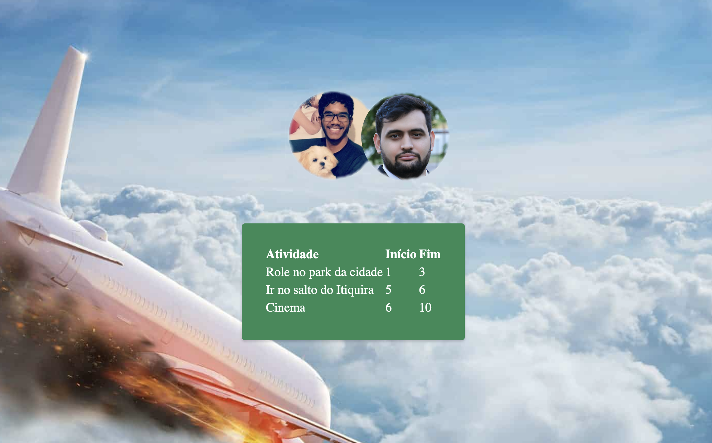

# Planejamento de Ferias

**Número da Lista**: 30<br>
**Conteúdo da Disciplina**: Greed<br>

## Alunos
|Matrícula | Aluno |
| -- | -- |
| 20/2028211  |  Antônio Aldísio de Sousa Alves Ferreira Filho |
| 19/0048221  |  Rodrigo Balbino Azevedo de Brito |

## Sobre

Era uma vez Rodrigo e seu amigo Antônio, dois estudantes universitários que estavam exaustos depois de semanas intensas de estudos.Eles estavam tão cansados que mal conseguiam se manter acordados durante as aulas. Mas, como bons aventureiros, eles decidiram aproveitar o final de semana para fazer uma viagem de descanso e diversão.

Essa história começa na sexta-feira à tarde, quando Rodrigo e Antônio, ansiosos pela aventura que os aguarda, encontram-se no aeroporto com suas malas cheias de expectativas. Com seus sorrisos brilhantes e espírito aventureiro, eles embarcam no avião rumo ao desconhecido.

Enquanto a viagem segue seu curso, Rodrigo e Antônio começam a imaginar todas as atividades divertidas que poderiam fazer. Saltar de paraquedas? Fazer um passeio de balão? Explorar trilhas e cachoeiras? As possibilidades são infinitas!

No entanto, quando chegam ao seu destino, eles percebem que esqueceram de fazer o planejamento adequado das atividades. É nesse momento que eles se voltam para você, caro leitor, em busca de ajuda para criar um cronograma épico e inesquecível.

## Screenshots





## Instalação

**Linguagem**: JavaScript <br>
**Framework**: React e Node.JS <br>

Node - 14

## Uso

Para instalar pacotes necessários
```
npm i
```

Para rodar o programa
```
npm start
```

[link para acesso local](localhost:3000/)
